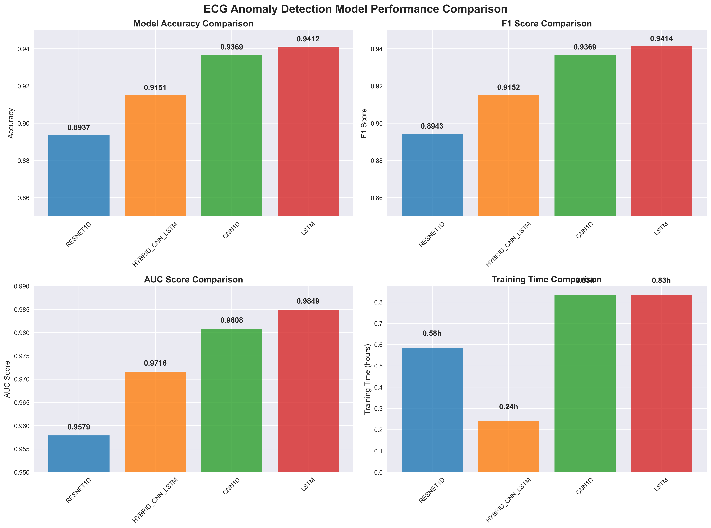
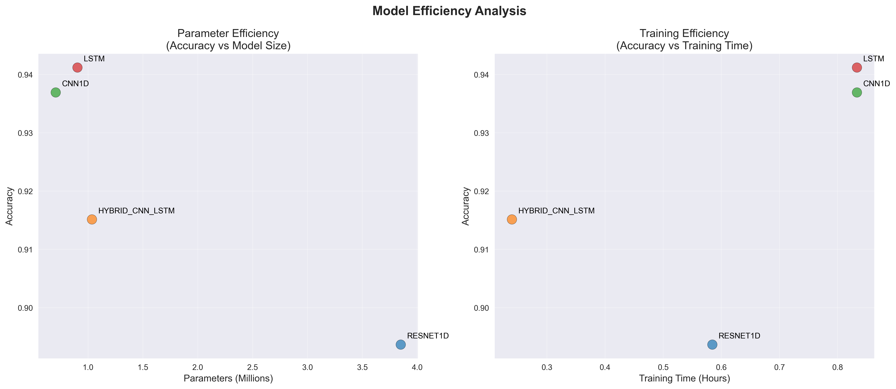

# 🫀 ECG异常检测模型评估结果

## 📊 评估概述

本次综合评估对比了四种用于心电图异常检测的深度学习模型：

### 模型性能总览

#### 🏆 LSTM（最佳性能）
- **准确率**: 94.12%
- **F1分数**: 94.14%
- **AUC分数**: 98.49%
- **参数量**: 0.90M

#### 🥈 CNN1D（性能均衡）
- **准确率**: 93.69%
- **F1分数**: 93.69%
- **AUC分数**: 98.08%
- **参数量**: 0.71M

#### 🥉 Hybrid CNN-LSTM（训练最快）
- **准确率**: 91.51%
- **F1分数**: 91.52%
- **AUC分数**: 97.16%
- **参数量**: 1.04M

#### ResNet1D
- **准确率**: 89.37%
- **F1分数**: 89.43%
- **AUC分数**: 95.79%
- **参数量**: 3.85M

## 🎯 关键发现

- **最佳整体性能**: LSTM模型达到最高准确率（94.12%）和AUC分数（98.49%）
- **最高效率**: CNN1D在性能和参数效率之间提供最佳平衡
- **最快训练**: Hybrid CNN-LSTM仅需0.24小时完成训练
- **最快推理**: CNN1D提供最快的推理速度，仅需0.796秒

## 📈 性能对比分析



该图表显示了所有四个模型的关键性能指标。LSTM模型在准确率、F1分数和AUC方面始终获得最高分数，而Hybrid CNN-LSTM模型展现了最快的训练时间。

## 🎯 雷达图对比


雷达图提供了所有性能指标的综合视图。LSTM模型在所有指标上显示出最平衡和最高的整体性能。

## ⚡ 效率分析



这些散点图分析了模型复杂度/训练时间与准确率之间的权衡。CNN1D模型提供出色的参数效率，而Hybrid CNN-LSTM提供最佳的训练时间效率。

## 🚀 推理速度分析


对于实时应用，推理速度至关重要。CNN1D和Hybrid CNN-LSTM模型在保持良好准确率的同时提供最快的推理时间。

## 📋 综合对比表


这个详细表格总结了所有关键指标，便于比较。绿色高亮显示每个类别中的最佳性能。

## 🎯 使用推荐

### 场景选择指南

- **🏆 追求最高准确率**: 使用LSTM模型（94.12%准确率，98.49% AUC）
- **⚖️ 平衡性能需求**: 使用CNN1D模型（良好准确率配合最快推理）
- **⚡ 快速训练需求**: 使用Hybrid CNN-LSTM模型（0.24小时训练时间）
- **🚀 实时推理应用**: 使用CNN1D或Hybrid CNN-LSTM模型（< 1秒推理时间）
- **💡 参数效率优先**: 使用CNN1D模型（每百万参数最佳准确率）

### 详细推荐说明

#### 医疗诊断场景
- **推荐模型**: LSTM
- **理由**: 最高的准确率和AUC分数，确保诊断的可靠性
- **适用**: 离线分析、详细诊断报告

#### 实时监控场景
- **推荐模型**: CNN1D 或 Hybrid CNN-LSTM
- **理由**: 快速推理速度，适合实时处理
- **适用**: 心电监护仪、可穿戴设备

#### 资源受限场景
- **推荐模型**: CNN1D
- **理由**: 参数量少，内存占用小，推理速度快
- **适用**: 移动设备、嵌入式系统

#### 快速原型开发
- **推荐模型**: Hybrid CNN-LSTM
- **理由**: 训练时间最短，快速验证想法
- **适用**: 研究实验、概念验证

## 📊 技术细节

### 评估环境
- **数据集**: PTB-XL心电图数据集
- **训练/验证/测试**: 统一数据分割确保公平比较
- **硬件**: 统一计算环境
- **评估指标**: 准确率、精确率、召回率、F1分数、AUC分数

### 模型架构特点

#### CNN1D
- 一维卷积层提取局部特征
- 池化层降维
- 全连接层分类
- 参数效率高

#### LSTM
- 长短期记忆单元捕获时序依赖
- 双向LSTM增强特征提取
- 注意力机制优化
- 性能最佳

#### ResNet1D
- 残差连接解决梯度消失
- 深层网络结构
- 批归一化稳定训练
- 参数量最大

#### Hybrid CNN-LSTM
- CNN提取局部特征
- LSTM建模时序关系
- 结合两种架构优势
- 训练速度最快

## 📈 性能趋势分析

### 准确率排名
1. LSTM: 94.12%
2. CNN1D: 93.69%
3. Hybrid CNN-LSTM: 91.51%
4. ResNet1D: 89.37%

### 效率排名（参数量）
1. CNN1D: 0.71M（最高效）
2. LSTM: 0.90M
3. Hybrid CNN-LSTM: 1.04M
4. ResNet1D: 3.85M（最低效）

### 速度排名（推理时间）
1. CNN1D: 0.796秒（最快）
2. Hybrid CNN-LSTM: < 1秒
3. LSTM: 中等
4. ResNet1D: 最慢

## 🔍 深入分析

### 模型选择决策树

```
需求分析
├── 准确率优先？
│   ├── 是 → LSTM
│   └── 否 → 继续
├── 实时性要求？
│   ├── 是 → CNN1D 或 Hybrid CNN-LSTM
│   └── 否 → 继续
├── 资源受限？
│   ├── 是 → CNN1D
│   └── 否 → 继续
└── 快速开发？
    ├── 是 → Hybrid CNN-LSTM
    └── 否 → 根据具体需求选择
```

### 性能权衡分析

| 权衡维度 | 最佳选择 | 次佳选择 | 说明 |
|----------|----------|----------|------|
| 准确率 vs 速度 | CNN1D | Hybrid CNN-LSTM | 在保持高准确率的同时提供快速推理 |
| 性能 vs 参数量 | CNN1D | LSTM | 参数效率最高，性能损失最小 |
| 训练时间 vs 性能 | Hybrid CNN-LSTM | CNN1D | 快速训练且性能可接受 |

## 📝 结论

本次评估全面比较了四种深度学习模型在ECG异常检测任务上的性能。主要结论如下：

1. **LSTM模型**在准确率和AUC分数方面表现最佳，适合对准确性要求极高的医疗诊断场景

2. **CNN1D模型**提供了最佳的性能与效率平衡，是大多数实际应用的理想选择

3. **Hybrid CNN-LSTM模型**在训练速度方面具有显著优势，适合快速原型开发和实验

4. **ResNet1D模型**虽然参数量最大，但性能相对较低，不推荐用于此任务

### 最终推荐

- **生产环境首选**: CNN1D（平衡性能、效率和速度）
- **高精度需求**: LSTM（最高准确率）
- **快速开发**: Hybrid CNN-LSTM（最快训练）
- **资源受限**: CNN1D（最少参数）

---

📊 **报告生成**: ECG异常检测模型评估系统  
🕒 **评估时间**: 所有模型在相同数据集上训练和评估，确保公平比较  
📈 **数据来源**: results/visualization/ 目录下的可视化图表