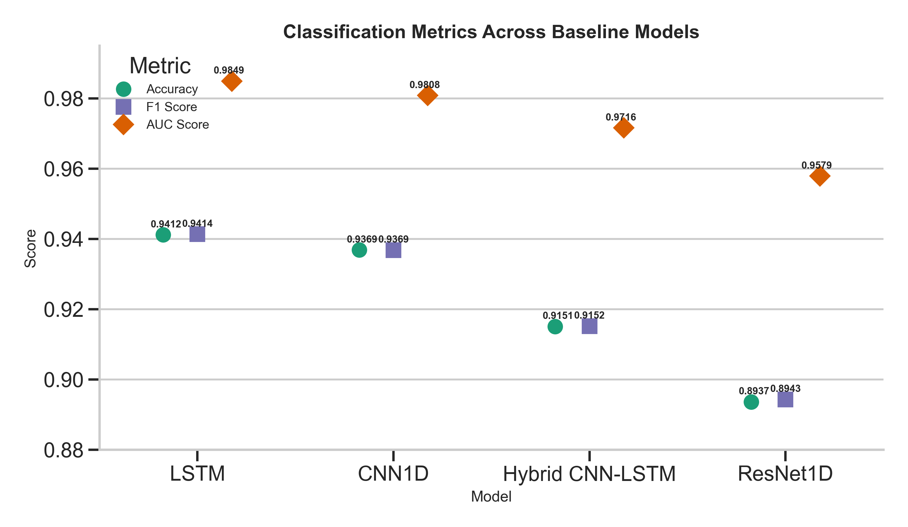
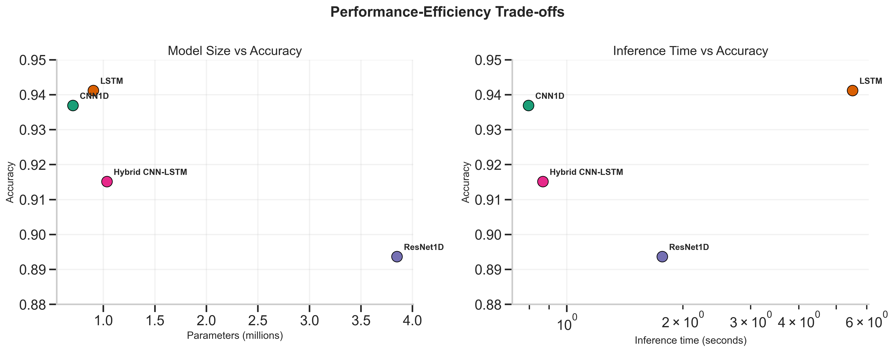

# Normal-vs-Abnormal 12-Lead ECG Classification on PTB-XL

This repository presents an exploratory biomedical machine learning benchmark on a focused supervised ECG task: distinguishing **normal** from **abnormal** 12-lead ECG recordings from **PTB-XL** using four baseline deep learning models.

The project is framed as a **transparent benchmark study**, not as a clinical diagnostic system. Its main value is in the task definition, preprocessing protocol, model comparison, command-line workflow, and explicit discussion of limitations.

## At a Glance

- **Dataset:** PTB-XL from PhysioNet
- **Task:** supervised normal-vs-abnormal 12-lead ECG classification
- **Models:** CNN1D, LSTM, ResNet1D, Hybrid CNN-LSTM
- **Protocol revision:** split-before-windowing with patient-level grouping when available
- **Imbalance handling:** label-preserving class-weighted loss
- **Best discrimination in the committed snapshot:** LSTM
- **Best practical baseline in the committed snapshot:** CNN1D

Useful repository artifacts:

- [results/comparison/model_comparison_results.csv](results/comparison/model_comparison_results.csv)
- [results/visualization/classification_metrics_comparison.png](results/visualization/classification_metrics_comparison.png)
- [results/visualization/performance_efficiency_tradeoff.png](results/visualization/performance_efficiency_tradeoff.png)
- [docs/EVALUATION_RESULTS.md](docs/EVALUATION_RESULTS.md)

## Problem Statement

**Task:** given a preprocessed fixed-length **12-lead ECG window** derived from a PTB-XL recording, predict whether it should be treated as **normal** or **abnormal** under the repository's binary labeling rule.

- **Input:** 12-lead ECG signal window
- **Output:** binary label
  - `0`: normal
  - `1`: abnormal
- **Primary goal:** compare discrimination performance and computational trade-offs across standard neural sequence models on a public biomedical waveform dataset

This is a **binary ECG classification benchmark**, not an unsupervised anomaly detector, not a multi-label ECG interpretation system, and not a claim of clinical readiness.

## Why This Task Matters

ECGs are among the most common cardiac tests in routine care. Even a coarse normal-versus-abnormal classification task is useful for studying how preprocessing choices, model architecture, and computational cost affect performance on real biomedical signals.

At the same time, this endpoint is much simpler than real clinical ECG interpretation. Strong performance here does **not** imply disease-specific diagnostic ability, uncertainty awareness, or readiness for clinical deployment.

## Experimental Protocol

### Protocol Revision

Earlier versions of this repository used a weaker preprocessing protocol. The current pipeline now assigns train/validation/test splits at the source-record level before any window segmentation, so overlapping windows from the same ECG recording cannot appear in multiple splits. The earlier label-contaminating imbalance heuristic has also been removed; class imbalance is now handled with label-preserving weighting during training.

This revision improves internal rigor and auditability, but it does not remove broader limitations such as single-dataset evaluation and the absence of external validation.

### Dataset and Task

- **Dataset source:** PTB-XL from PhysioNet
- **Signal type:** 12-lead ECG
- **Implemented waveform path:** low-resolution PTB-XL signals loaded from the `records100` directory
- **Task definition:** supervised binary classification of fixed-length ECG windows derived from PTB-XL recordings
- **Prediction target:** `0 = normal`, `1 = abnormal`

Signals are processed with high-pass and low-pass filtering, optional notch filtering when the sampling rate permits it, and per-lead standardization before window extraction.

### Label Definition

The repository implements a record-level binary label derived from PTB-XL `scp_codes`:

- A record is labeled **normal** if `NORM >= 50` and there is no other non-`SR` code with confidence `>= 50`
- Otherwise the record is labeled **abnormal**

All windows from a source record inherit that record-level binary label. This creates a coarse normal-vs-abnormal endpoint rather than a disease-specific ECG diagnosis task.

### Split Strategy

- **Split order:** split first, then segment
- **Preferred grouping:** patient-level splitting when `patient_id` is available in the metadata
- **Fallback:** record-level splitting when patient identifiers are unavailable or incomplete
- **Windowing:** fixed-length segmentation with 50% overlap, applied only after split assignment
- **Leakage control:** all windows from the same source record remain in exactly one split

### Imbalance Handling

Class imbalance is handled with **inverse-frequency class weighting** computed from the training split only and applied through weighted cross-entropy loss. The current pipeline does **not** relabel samples or move normal records into the abnormal class.

### Evaluation Metrics

The benchmark workflow reports:

- Accuracy
- Weighted precision
- Weighted recall
- Weighted F1 score
- ROC-AUC based on the abnormal-class probability
- Parameter count
- Inference time
- Training time when models are trained through the current CLI workflow
- Prediction-level outputs for the test split
- Confusion matrix, precision-recall curve, ROC curve, threshold sweep, and per-class metrics

## Key Results

The results below should be interpreted as a **committed benchmark snapshot**, not as a guaranteed full rerun under the revised protocol unless they are regenerated from the current code path.

The committed comparison artifact in [results/comparison/model_comparison_results.csv](results/comparison/model_comparison_results.csv) reports:

| Model | Accuracy | F1 Score | AUC Score | Parameters | Inference Time (s) |
|-------|----------|----------|-----------|------------|--------------------|
| CNN1D | 0.9369 | 0.9369 | 0.9808 | 705,218 | 0.796 |
| LSTM | **0.9412** | **0.9414** | **0.9849** | 903,298 | 5.514 |
| ResNet1D | 0.8937 | 0.8943 | 0.9579 | 3,849,858 | 1.769 |
| Hybrid CNN-LSTM | 0.9151 | 0.9152 | 0.9716 | 1,035,458 | 0.867 |

In this committed snapshot, **LSTM** achieved the strongest discrimination performance across the reported classification metrics. **CNN1D** provided the most practical efficiency trade-off in terms of parameter count and reported inference time while remaining close to LSTM in Accuracy, F1, and AUC. **ResNet1D** was the largest model and also the weakest performer in this comparison, while **Hybrid CNN-LSTM** occupied a middle position without clearly outperforming the simpler CNN1D baseline.

The figures below are generated directly from [results/comparison/model_comparison_results.csv](results/comparison/model_comparison_results.csv) using [scripts/visualize_all_models.py](scripts/visualize_all_models.py).

### Benchmark Visualizations



The classification metrics are tightly clustered for the two strongest baselines, with **LSTM** holding a small but consistent lead over **CNN1D** across Accuracy, F1, and ROC-AUC.



The trade-off plot makes the practical recommendation clearer: **CNN1D** retains near-best discrimination performance with lower model size and much lower reported inference time than **LSTM**, while **ResNet1D** is both larger and weaker in this committed result snapshot.

I treat the discrimination metrics above as the most useful summary. Some training-time fields in the repository are less reliable than accuracy, F1, or AUC and should be interpreted more cautiously.

## Limitations

This repository is best read as a **baseline comparison study**, with several important limitations:

- **Single-dataset evaluation:** all benchmarks are derived from PTB-XL only, so robustness across institutions, devices, acquisition settings, and patient populations is not established.
- **Simplified binary framing:** the implemented endpoint is a coarse normal-versus-abnormal classification task based on SCP-code rules, not disease-specific ECG diagnosis or full clinical interpretation.
- **Window labels inherit record labels:** each extracted window receives the binary label of its source record, which is practical for benchmarking but does not guarantee that abnormal morphology is present in every labeled abnormal window.
- **No external validation:** there is no independent hospital cohort, temporal validation, or cross-dataset replication in the current repository.
- **Generalization remains uncertain:** the revised split-before-windowing protocol improves internal validity, but it does not by itself demonstrate out-of-distribution performance or stability under dataset shift.
- **No clinical deployment claim:** the repository does not evaluate calibration, uncertainty, subgroup performance, clinical workflow integration, or prospective utility, and should be interpreted as a research benchmark rather than a deployable medical system.

Because of these limitations, the current results should be interpreted as **exploratory benchmark results**, not as evidence of clinical deployment readiness.

## Reproducibility

### What Is Committed In This Repository

- dependency list in [requirements.txt](requirements.txt)
- a default runtime config in [configs/config.yaml](configs/config.yaml)
- model definitions in [src/comparison_models.py](src/comparison_models.py)
- data loading and preprocessing code in [src/data_loader.py](src/data_loader.py)
- a module-based workflow in [src/cli.py](src/cli.py) and [src/benchmark.py](src/benchmark.py)
- evaluation artifact generation in [src/evaluation_artifacts.py](src/evaluation_artifacts.py)
- visualization helpers in [scripts/visualize_all_models.py](scripts/visualize_all_models.py)
- committed summary results in [results/comparison/model_comparison_results.csv](results/comparison/model_comparison_results.csv)
- committed summary figures under [results/visualization/](results/visualization)
- supplementary notes in [docs/EVALUATION_RESULTS.md](docs/EVALUATION_RESULTS.md)

### What The Pipeline Generates When Rerun

After preprocessing, training, and evaluation, the current code path writes:

- processed arrays under `data/processed/`
- per-split record and window manifests under `data/processed/`
- a combined split manifest under `results/comparison/preprocessing/`
- one prediction CSV per model under `results/comparison/predictions/`
- per-model evaluation artifacts under `results/comparison/evaluation/`

These generated artifacts are intentionally excluded from version control in the public repository.

### Tested Environment

- smoke-checked on Windows with Python 3.13
- `python -m src --help` runs successfully in the published repository
- `python -m unittest discover -s tests -v` passes, with one skipped test when the optional `wfdb` dependency is unavailable
- full preprocessing requires PTB-XL and the waveform-loading dependency stack

### Intended Rerun Path

```bash
pip install -r requirements.txt
python -m src preprocess --config configs/config.yaml
python -m src train --config configs/config.yaml --models cnn1d lstm resnet1d hybrid_cnn_lstm
python -m src evaluate --config configs/config.yaml --models cnn1d lstm resnet1d hybrid_cnn_lstm
python scripts/visualize_all_models.py
```

### Current Gaps

- the processed split files used for the committed runs are not included
- exact regeneration of the published numbers from a fresh checkout is still **not guaranteed**
- some committed results may predate the current preprocessing protocol revision

### Data Setup

The loader expects PTB-XL under:

```text
data/raw/ptb-xl-a-large-publicly-available-electrocardiography-dataset-1.0.1/
```

The raw data itself is not redistributed in this repository.

## Code Organization

- [src/](src): core data loading, model definitions, benchmark workflow, CLI, and evaluation artifact generation
- [scripts/](scripts): setup, visualization, and supplementary helper scripts
- [configs/](configs): runtime configuration
- [tests/](tests): lightweight checks for CLI dispatch, config loading, model instantiation, and mocked preprocessing sanity
- [results/](results): selected committed benchmark summaries
- [docs/](docs): supplementary notes

## Additional Documentation

- Supplementary evaluation note: [docs/EVALUATION_RESULTS.md](docs/EVALUATION_RESULTS.md)

## Summary

This project is strongest when presented as:

- a focused **normal-vs-abnormal ECG classification benchmark**
- built on a real public biomedical dataset
- comparing multiple neural baselines under a clearer protocol than the original version
- with a reproducible command-line workflow and lightweight tests
- and with explicit acknowledgment of current experimental and reproducibility limitations

That framing is more credible than presenting the repository as a polished framework or as a clinically validated medical AI system.
