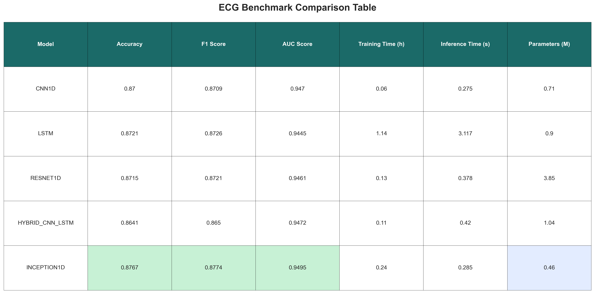
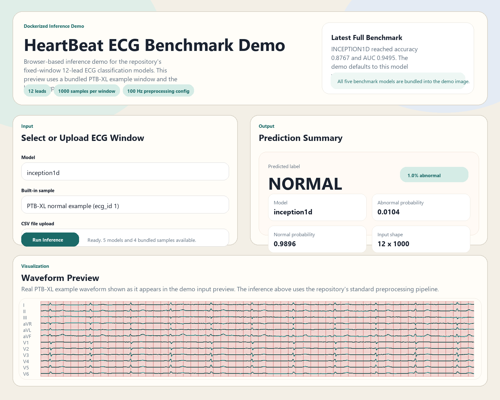
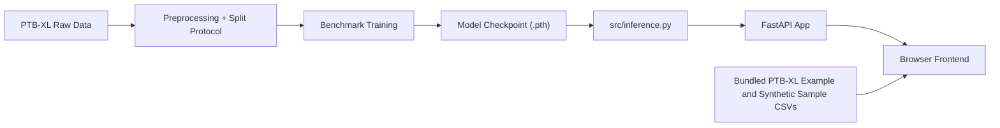
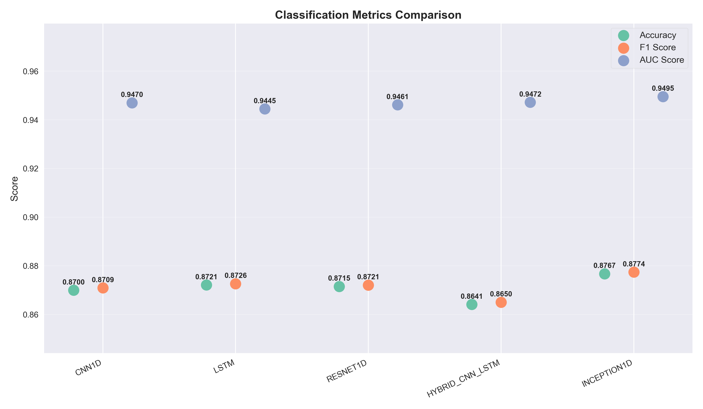
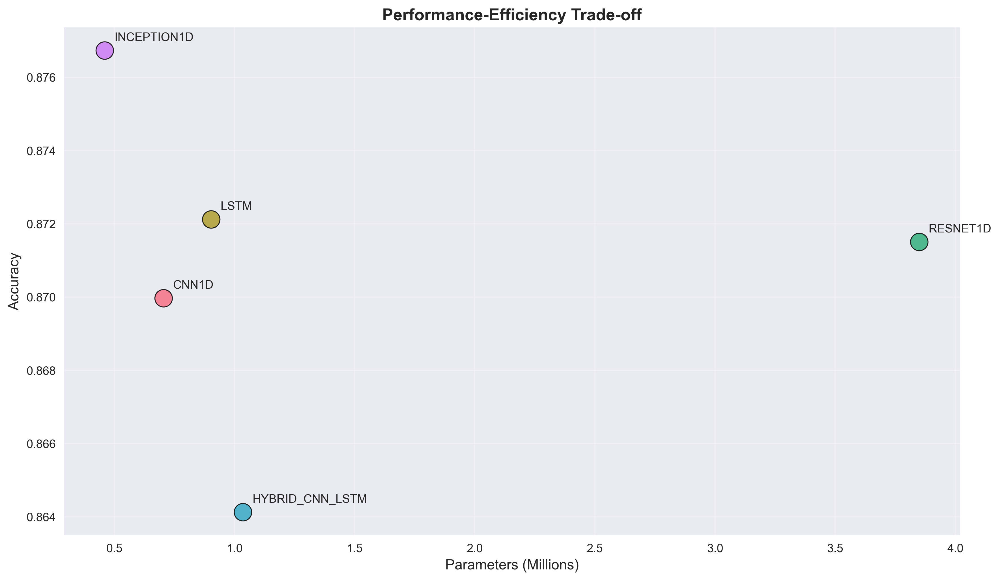

# HeartBeat: ECG Benchmark and Dockerized Inference Demo

HeartBeat is a **biomedical machine learning benchmark** and **deployable web demo** for supervised **normal-vs-abnormal 12-lead ECG classification**.

The repository has two deliberately separate layers:

- a **research benchmark** on **PTB-XL**
- a **Dockerized inference demo** for fixed-format ECG windows

It is intended as a **transparent portfolio project**, not as a clinical diagnostic system.



## At a Glance

- **Dataset:** PTB-XL from [PhysioNet](https://physionet.org/content/ptb-xl/1.0.1/)
- **Task:** supervised binary classification of fixed-length 12-lead ECG windows
- **Models:** CNN1D, LSTM, ResNet1D, Hybrid CNN-LSTM, Inception1D
- **Protocol revision:** split-before-windowing with patient-level grouping when available
- **Imbalance handling:** label-preserving class-weighted loss
- **Latest full benchmark winner:** Inception1D
- **Deployment:** FastAPI + browser frontend + Docker
- **Demo inputs:** bundled synthetic CSV samples or user-uploaded CSV

## Problem Statement

Given a preprocessed fixed-length **12-lead ECG window**, predict whether it should be treated as:

- `0`: normal
- `1`: abnormal

This repository implements a **binary ECG classification benchmark**. It does **not** implement:

- unsupervised anomaly detection
- disease-specific multi-label ECG diagnosis
- a clinically validated decision-support tool

## Dataset

This project uses **PTB-XL**, a large public 12-lead ECG dataset released through **PhysioNet**.

- Project page: [PTB-XL on PhysioNet](https://physionet.org/content/ptb-xl/1.0.1/)
- Direct ZIP download: [PTB-XL v1.0.1 ZIP](https://physionet.org/content/ptb-xl/get-zip/1.0.1/)
- Reference paper: [Wagner et al., 2020](https://pubmed.ncbi.nlm.nih.gov/32451379/)

The current implementation expects the extracted dataset under:

```text
data/raw/ptb-xl-a-large-publicly-available-electrocardiography-dataset-1.0.1/
```

The loader reads the low-resolution waveform files from the `records100/` directory.  
The raw dataset is **not redistributed** in this repository.

## Project Structure

```text
.
|-- app/                # FastAPI web demo and browser frontend
|-- artifacts/          # deployable checkpoint location
|-- configs/            # runtime configuration
|-- data/               # raw / processed data paths
|-- docs/               # supplementary notes
|-- results/            # selected committed benchmark artifacts
|-- scripts/            # visualization and helper scripts
|-- src/                # benchmark, models, preprocessing, inference
|-- tests/              # lightweight smoke tests
|-- Dockerfile
|-- docker-compose.yml
`-- README.md
```

Key files:

- [src/data_loader.py](src/data_loader.py): PTB-XL loading, labeling, split generation, preprocessing
- [src/benchmark.py](src/benchmark.py): training and evaluation workflow
- [src/comparison_models.py](src/comparison_models.py): benchmark model definitions
- [src/inference.py](src/inference.py): checkpoint loading and single-window inference
- [src/signal_preprocessing.py](src/signal_preprocessing.py): shared preprocessing between benchmark and demo
- [app/main.py](app/main.py): FastAPI entry point

## Benchmark Models

- **CNN1D:** simple convolutional baseline for local waveform morphology
- **LSTM:** recurrent baseline for longer temporal dependencies
- **ResNet1D:** deeper residual convolutional baseline
- **Hybrid CNN-LSTM:** mixed convolutional and recurrent baseline
- **Inception1D:** multi-scale 1D convolutional baseline with parallel kernels and residual shortcuts

The **Inception1D** model was added as a clean, benchmark-friendly multi-scale baseline for ECG signals. It is more expressive than a plain CNN while still easier to explain and deploy than a more elaborate custom architecture.

## Benchmark Workflow

Install dependencies:

```bash
pip install -r requirements.txt
```

Run the benchmark pipeline:

```bash
python -m src preprocess --config configs/config.yaml
python -m src train --config configs/config.yaml --models cnn1d lstm resnet1d hybrid_cnn_lstm inception1d
python -m src evaluate --config configs/config.yaml --models cnn1d lstm resnet1d hybrid_cnn_lstm inception1d
python scripts/visualize_all_models.py
```

Useful overrides:

```bash
python -m src train --config configs/config.yaml --models inception1d --epochs 20 --batch-size 16
python -m src evaluate --config configs/config.yaml --models cnn1d inception1d --results-dir results/comparison
```

## Dockerized Web Demo

The repository also includes a small **FastAPI** app with a browser frontend for **single-window ECG inference demos**.

The demo supports:

- choosing a bundled sample input
- uploading a numeric ECG CSV
- selecting an available checkpoint
- running one-window inference
- viewing waveform preview and class probabilities
- defaulting to the strongest available model from the latest full benchmark run



The preview above is generated from the current demo layout with a bundled **PTB-XL example window** and the default `Inception1D` checkpoint.

Regenerate it with:

```bash
python scripts/generate_demo_screenshot.py
```

### Demo Scope

The web demo is intentionally narrow:

- it only supports the repository's fixed-format ECG window task
- it only performs inference, not training
- it is a research/demo interface, not a clinical product

### Demo Architecture



### Run the Web App Locally

```bash
pip install -r requirements.txt
uvicorn app.main:app --host 0.0.0.0 --port 8000
```

Then open:

```text
http://localhost:8000
```

### Run with Docker

```bash
docker build -t heartbeat-web .
docker run -p 8000:8000 -e HEARTBEAT_DEVICE=cpu heartbeat-web
```

Or with Compose:

```bash
docker compose up --build
```

### One-Click Demo Flow

The Docker image bundles every benchmark checkpoint found under
`artifacts/checkpoints/` at build time. In the current workspace, that means
the container starts with **all five benchmark models available in the UI**
without any extra volume mounts.

After the container starts:

1. Open `http://localhost:8000`
2. Choose a bundled sample or upload your own CSV
3. Select any available model from the dropdown: `cnn1d`, `lstm`, `resnet1d`, `hybrid_cnn_lstm`, or `inception1d`
4. Run inference and inspect the waveform preview plus prediction scores

### Demo Inputs

The web demo accepts:

- numeric CSV only
- shape `12 x 1000`
- or transposed shape `1000 x 12`
- no header rows

Bundled sample inputs live under [sample_inputs/](sample_inputs).  
The committed sample set includes a small number of **real PTB-XL example windows** plus synthetic fallback demo inputs.
The UI preloads a bundled PTB-XL normal example by default and renders the waveform on a light ECG-style grid for easier inspection.

### Checkpoint Discovery

The demo looks for checkpoints in:

- [artifacts/checkpoints/](artifacts/checkpoints)
- `results/comparison/models/`

Important:

- the Docker image bundles any `.pth` checkpoints present under `artifacts/checkpoints/` during build
- in this workspace, the intended image includes **all five benchmark models**
- the web UI lists every bundled model in the selector and defaults to **Inception1D**
- if you build from a checkout without local checkpoint files, the UI still starts but inference remains unavailable until checkpoints are added

See [artifacts/README.md](artifacts/README.md) for the expected layout.

## Experimental Protocol

### Protocol Revision

Earlier versions of this repository used a weaker preprocessing protocol. The current pipeline now assigns train/validation/test splits at the **source-record level before any window segmentation**, so overlapping windows from the same ECG recording cannot appear in multiple splits. The earlier label-contaminating imbalance heuristic has also been removed; class imbalance is now handled with **label-preserving class weighting** during training.

### Label Definition

Record-level labels are derived from PTB-XL `scp_codes`:

- **normal** if `NORM >= 50` and no other non-`SR` code has confidence `>= 50`
- **abnormal** otherwise

All windows from a source record inherit that record-level binary label.

### Split Strategy

- split first, then segment
- patient-level grouping when `patient_id` is available
- record-level fallback otherwise
- fixed-length windowing with 50% overlap only after split assignment

### Imbalance Handling

Class imbalance is handled with **inverse-frequency class weighting** computed from the training split only. The current code does **not** relabel or contaminate classes.

### Evaluation Metrics

The benchmark workflow reports:

- Accuracy
- Weighted precision
- Weighted recall
- Weighted F1 score
- ROC-AUC
- Parameter count
- Inference time
- Prediction-level CSV outputs
- Confusion matrix, ROC/PR curves, threshold sweep, and per-class metrics

## Key Results

The latest full local benchmark rerun is recorded in:

- [results/full_benchmark_all_models_20260331/model_comparison_results.csv](results/full_benchmark_all_models_20260331/model_comparison_results.csv)

| Model | Accuracy | F1 Score | AUC Score | Parameters | Inference Time (s) |
|-------|----------|----------|-----------|------------|--------------------|
| CNN1D | 0.8700 | 0.8709 | 0.9470 | 705,218 | **0.275** |
| LSTM | 0.8721 | 0.8726 | 0.9445 | 903,298 | 3.117 |
| ResNet1D | 0.8715 | 0.8721 | 0.9461 | 3,849,858 | 0.378 |
| Hybrid CNN-LSTM | 0.8641 | 0.8650 | 0.9472 | 1,035,458 | 0.420 |
| Inception1D | **0.8767** | **0.8774** | **0.9495** | **460,226** | 0.285 |

In this full benchmark run, **Inception1D** delivered the strongest overall discrimination performance and was also the smallest model by parameter count. **CNN1D** remained the fastest model at inference time, but the gap in runtime was small relative to the performance gain from **Inception1D**, making **Inception1D** the strongest practical default for the current repository state.

### Visualization Artifacts

The latest full-run figures are available under:

- [results/full_benchmark_all_models_20260331/visualization/classification_metrics_comparison.png](results/full_benchmark_all_models_20260331/visualization/classification_metrics_comparison.png)
- [results/full_benchmark_all_models_20260331/visualization/performance_efficiency_tradeoff.png](results/full_benchmark_all_models_20260331/visualization/performance_efficiency_tradeoff.png)
- [results/full_benchmark_all_models_20260331/visualization/comprehensive_table.png](results/full_benchmark_all_models_20260331/visualization/comprehensive_table.png)

They were generated with:

```bash
python scripts/visualize_all_models.py --results-csv results/full_benchmark_all_models_20260331/model_comparison_results.csv --output-dir results/full_benchmark_all_models_20260331/visualization
```





## Limitations

This repository should be read as a **benchmark study plus deployable demo**, not as evidence of clinical readiness.

- **Single-dataset evaluation:** all reported benchmark results come from PTB-XL
- **Simplified endpoint:** the task is coarse normal-vs-abnormal classification, not disease-specific diagnosis
- **No external validation:** no independent cohort or cross-dataset replication is included
- **Window labels inherit record labels:** abnormal windows may not always contain localized abnormal morphology
- **Generalization remains uncertain:** protocol fixes improve internal validity but do not prove robustness under dataset shift
- **No clinical deployment claim:** the demo is an inference interface for a benchmark model, not a validated medical tool

## Testing

The repository includes lightweight tests for:

- CLI dispatch
- config loading
- model instantiation
- inference utilities
- mocked preprocessing sanity checks
- API smoke tests when optional web dependencies are installed

Run them with:

```bash
python -m unittest discover -s tests -v
```

## Reproducibility Notes

Committed in this repository:

- benchmark code
- web demo code
- runtime configuration
- selected summary results
- synthetic sample inputs for deployment testing

Not committed by default:

- raw PTB-XL data
- processed splits
- generated prediction artifacts
- trained checkpoints in version control

This keeps the public repository smaller and easier to inspect. A local or release build can still bundle demo checkpoints into the Docker image, but exact reruns of previously committed benchmark numbers are not guaranteed from a fresh checkout without the missing data artifacts.

## Additional Documentation

- [docs/EVALUATION_RESULTS.md](docs/EVALUATION_RESULTS.md)
- [sample_inputs/README.md](sample_inputs/README.md)
- [artifacts/README.md](artifacts/README.md)

## Summary

HeartBeat is strongest when presented as:

- a focused **biomedical ML benchmark** on PTB-XL
- with a revised and more defensible preprocessing protocol
- plus a **Dockerized inference demo** with a browser frontend
- and with explicit limits on what the project does and does not claim

