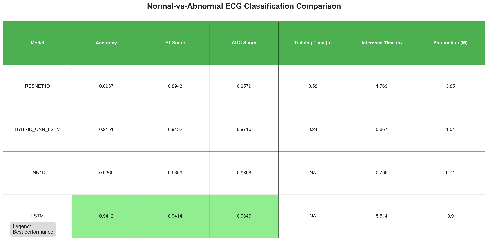

# ECG Benchmark Result Note

This note summarizes the small set of committed result artifacts kept in the
public repository for portfolio and interview use.

## Scope

The repository presents a **supervised normal-vs-abnormal ECG classification
benchmark** on **PTB-XL**. It should be read as a benchmark study on a public
dataset, not as a clinical diagnostic system.

## Committed Summary Artifacts

- [../results/comparison/model_comparison_results.csv](../results/comparison/model_comparison_results.csv)
- [../results/visualization/comprehensive_table.png](../results/visualization/comprehensive_table.png)

## Result Snapshot

| Model | Accuracy | F1 Score | AUC Score | Parameters | Inference Time (s) |
|------|----------|----------|-----------|-----------:|-------------------:|
| CNN1D | 0.9369 | 0.9369 | 0.9808 | 705,218 | 0.796 |
| LSTM | **0.9412** | **0.9414** | **0.9849** | 903,298 | 5.514 |
| ResNet1D | 0.8937 | 0.8943 | 0.9579 | 3,849,858 | 1.769 |
| Hybrid CNN-LSTM | 0.9151 | 0.9152 | 0.9716 | 1,035,458 | 0.867 |

## Short Interpretation

- **Best reported discrimination:** LSTM has the highest committed accuracy, F1 score, and ROC-AUC.
- **Most practical baseline:** CNN1D gives the best performance-efficiency trade-off in this snapshot.
- **Largest and weakest here:** ResNet1D has the largest parameter count and the weakest committed classification performance.

## Figure

## Caveat

These numbers are best interpreted as **exploratory benchmark results** under
the repository protocol. They do not establish external validity or clinical
deployment readiness.
